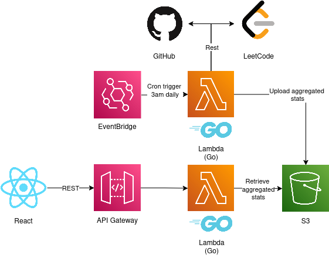

# Personal Portfolio — Backend (Go + AWS Lambda)

This repository contains the **serverless backend** for my personal developer portfolio website.  
It’s written in **Go** and deployed on **AWS Lambda**, serving data to the frontend hosted on GitHub Pages.

**Frontend Repo:** [Portfolio Frontend (React + TypeScript)](https://github.com/limyunle/portfolio-frontend)

---

## Overview

The backend aggregates data from third-party APIs (GitHub and LeetCode), stores it in AWS S3, and serves it via API Gateway.  
It follows a fully serverless design with daily data refresh via AWS EventBridge (cron).

---

## Architecture

```text
GitHub API + LeetCode API
        ↓
Lambda (Refresh job @ 3AM) → Aggregate data → Store in S3
        ↓
Frontend API call → Lambda (Go handler) → Serve data from S3
```


